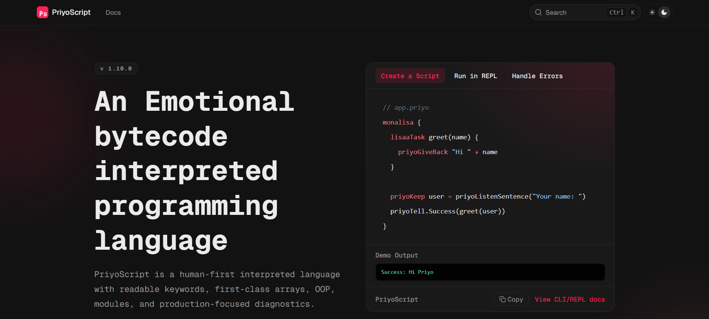

# PriyoScript Web



---

## Overview

[](https://priyoscript.vercel.app)

[](https://github.com/nsgpriyanshu/PriyoScript/commits/main)

This package contains the official documentation website for **PriyoScript**, located inside the `web/` directory of the main monorepo.

The web app is independently versioned, independently released, and deployed separately from the core PriyoScript CLI.

Live site:
👉 [https://priyoscript.vercel.app](https://priyoscript.vercel.app)

---

## Purpose

The web application provides:

- Official documentation portal
- Stable & Canary documentation channels
- MDX-based content system
- Syntax-highlighted code examples (Shiki)
- Independent changelog & release workflow

This ensures documentation evolves independently of the language runtime.

---

## Monorepo Structure

- `web/` is a fully isolated Next.js application.
- It has its own `package.json`.
- It has its own versioning system.
- It has its own release process.
- It does NOT affect the CLI runtime build.

---

## Technology Stack

The documentation platform is built using:

- Next.js 16
- TypeScript
- Fumadocs
- Tailwind CSS v4
- Shiki (for syntax highlighting)
- Cliff-jumper (web-only versioning & changelog automation)

The goal is long-term maintainability with modern tooling.

---

## Local Development (Maintainers)

From the repository root:

### Install dependencies

```bash
npm --prefix web install
```

### Start development server

```bash
npm --prefix web run dev
```

Open:

```
http://localhost:3000
```

---

### Build for production

```bash
npm --prefix web run build
npm --prefix web run start
```

---

### Type checking

```bash
npm --prefix web run types:check
```

---

## Web Versioning & Release Flow

The documentation site maintains its own versioning strategy, separate from the main PriyoScript runtime.

Dry run:

```bash
npm --prefix web run release:dry
```

Actual release:

```bash
npm --prefix web run release
```

Also available from repository root:

```bash
npm run release:web:dry
npm run release:web
```

Release configuration files:

- `web/.cliff-jumperrc.json`
- `web/cliff.toml`
- `web/CHANGELOG.md`

This ensures documentation changes are traceable, versioned, and decoupled from CLI releases.

---

## Deployment

The documentation site is deployed on Vercel.

Deployment is triggered automatically via the connected GitHub repository.

Production URL:
[https://priyoscript.vercel.app](https://priyoscript.vercel.app)

---

## Contact

- Issues: [https://github.com/nsgpriyanshu/PriyoScript/issues](https://github.com/nsgpriyanshu/PriyoScript/issues)
- Repository: [https://github.com/nsgpriyanshu/PriyoScript](https://github.com/nsgpriyanshu/PriyoScript)
- Documentation site: [https://priyoscript.vercel.app](https://priyoscript.vercel.app)

---

## Maintainer

This website is maintained by:

<div>
  <a href="https://nsgpriyanshu.github.io">
    
  </a>
</div>
